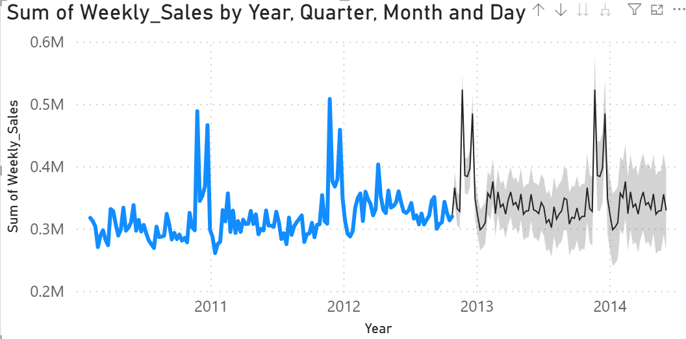
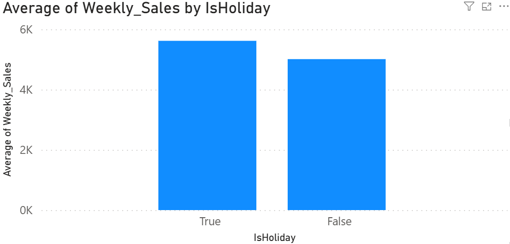
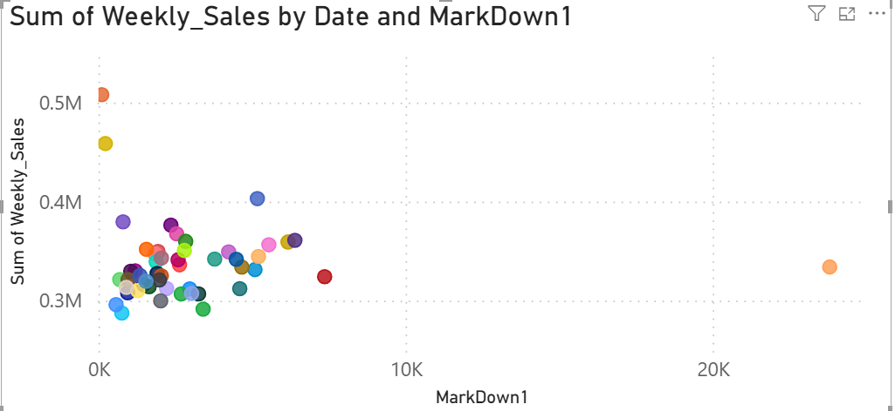
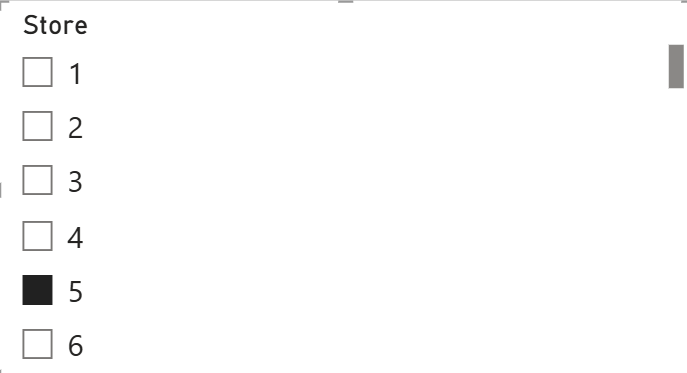
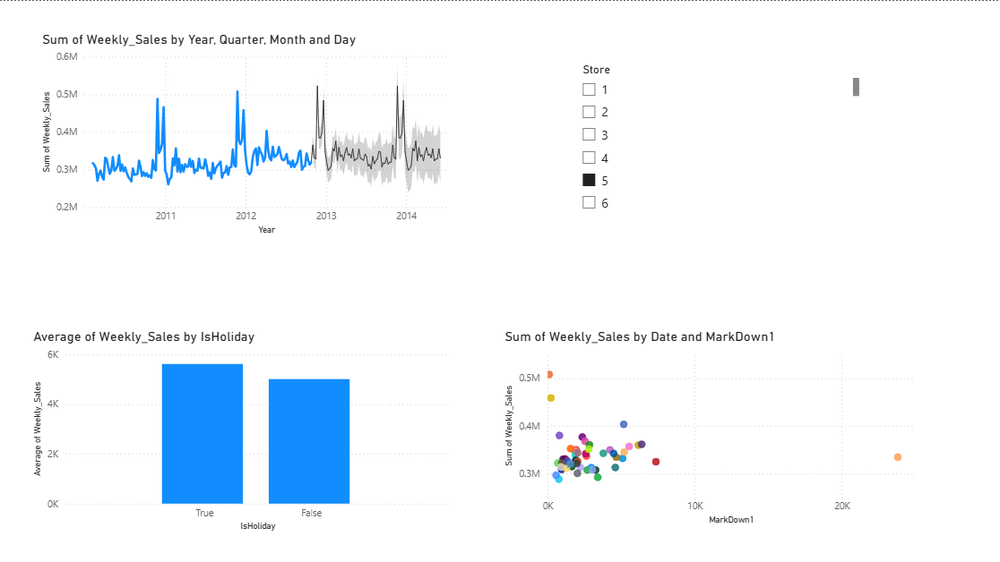
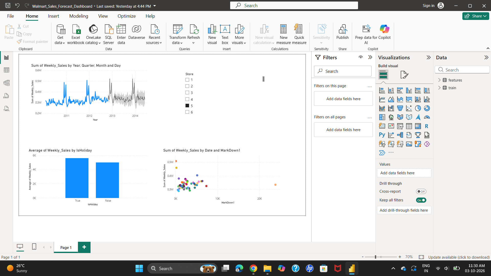

# Walmart Sales Forecast Dashboard

Interactive Power BI dashboard analyzing real Walmart sales data with forecasting.

## 📊 Overview

This project analyzes **420,000+ real weekly sales records** across 45 Walmart stores (2010–2012), using the official Walmart Sales Forecasting dataset. The dashboard includes a working sales forecast, store-level filtering, and data-driven insights into holiday and promotional sales patterns.

## 🎯 What It Does

- Cleans and merges real-world retail sales data with store-level contextual data (temperature, fuel prices, promotions, CPI, unemployment)
- Builds an interactive sales trend chart with a native Power BI forecast (12-week projection with confidence intervals)
- Allows real-time filtering by store (compare any combination of the 45 stores)
- Analyzes the impact of holidays and promotions on weekly sales

## 🛠️ Tools Used

- **Power BI Desktop** — dashboard building, DAX, native forecasting
- **Power Query** — data cleaning, merging, and feature engineering

## 📁 Dataset

Real data from the [Walmart Recruiting - Store Sales Forecasting](https://www.kaggle.com/c/walmart-recruiting-store-sales-forecasting) competition dataset:
- `train.csv` — 421,570 weekly sales records (Store, Dept, Date, Weekly_Sales, IsHoliday)
- `features.csv` — store-level context (Temperature, Fuel_Price, MarkDown1-5, CPI, Unemployment)

## 🔍 Key Findings

- **Holiday weeks show ~9-10% higher average sales** than non-holiday weeks, confirming the expected seasonal retail pattern
- **Promotion size (MarkDown) shows no strong correlation with sales increase** — bigger promotional spend did not clearly translate to higher sales, suggesting other factors (timing, product type) may matter more than discount size alone

## 📷 Dashboard Screenshots

## 🚀 How to Use

1. Download `train.csv` and `features.csv` from this repo (or the original Kaggle competition)
2. Open the `.pbix` file in Power BI Desktop
3. Use the Store slicer to filter by individual stores
4. View the forecast on the main sales trend chart

## 📝 What I Learned

This project involved cleaning real, messy data (handling missing promotional and economic values correctly), merging multiple real-world data sources, and using Power BI's native time-series forecasting — all without writing custom code, demonstrating that solid data analysis depends more on understanding the data correctly than on tool complexity.
